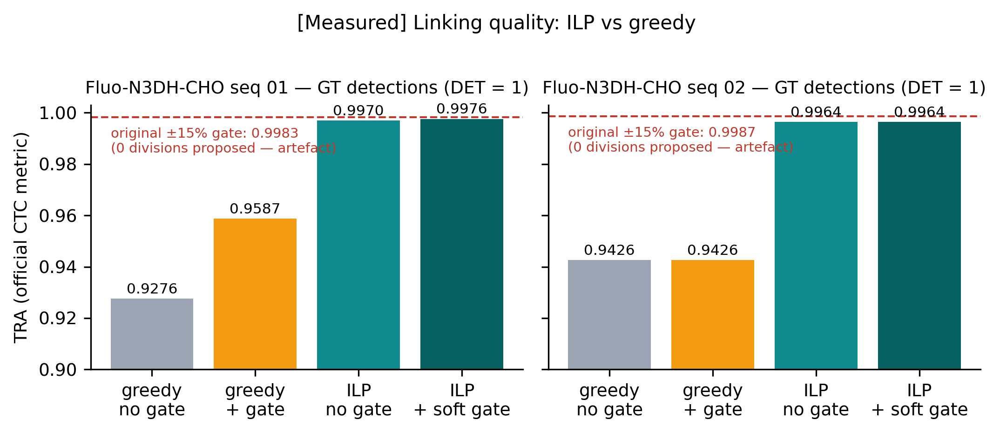
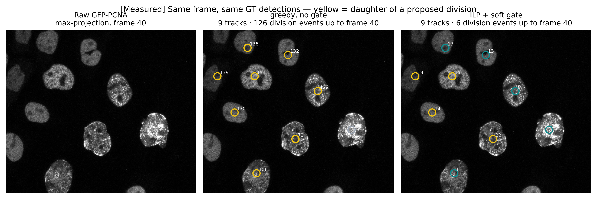
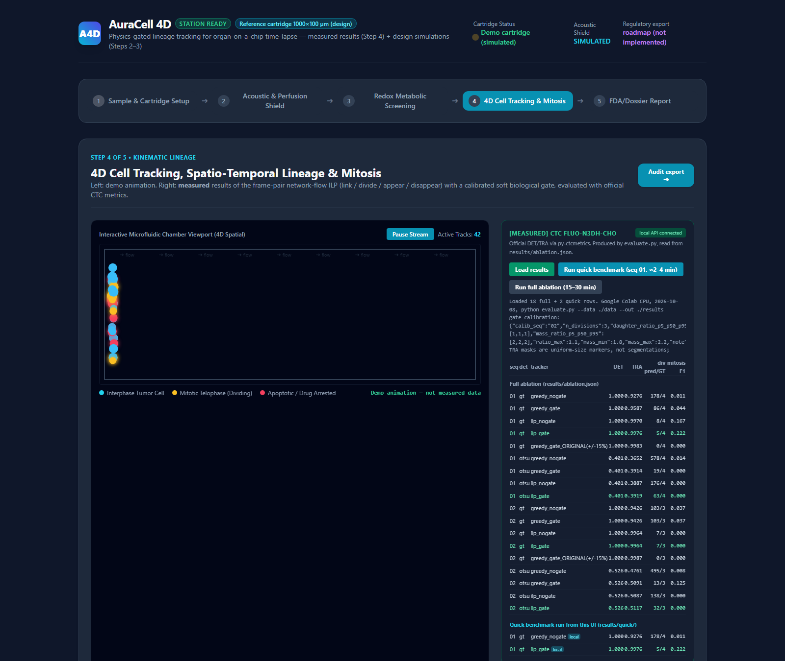
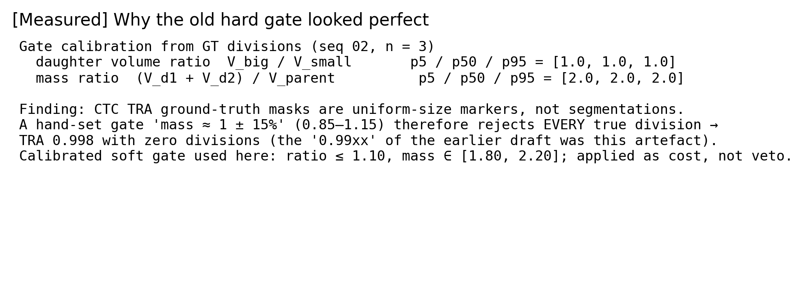
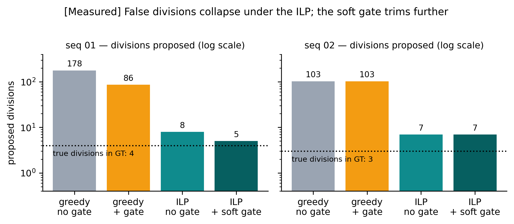
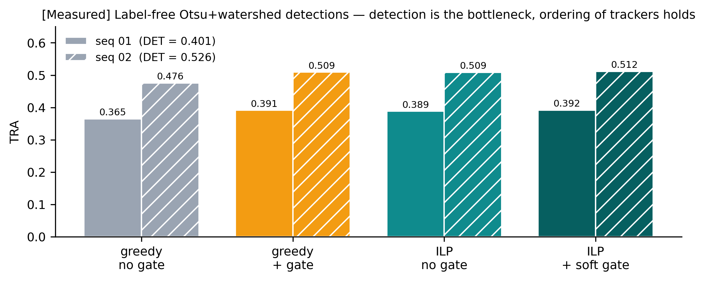
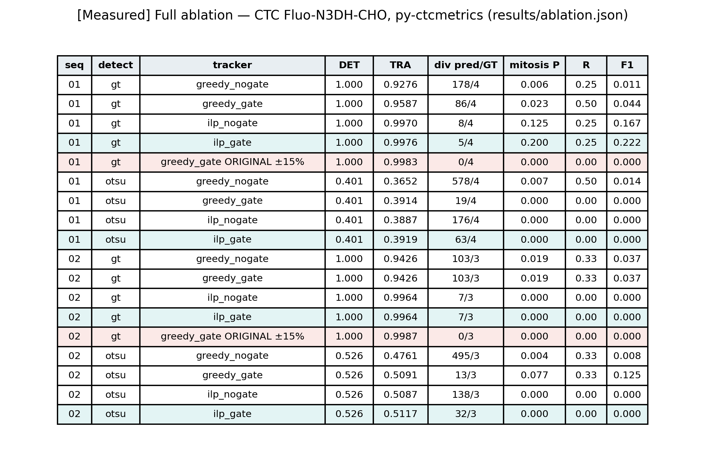

# TECHNICAL REPORT
## AuraCell 4D: Physics-Gated Network-Flow ILP Lineage Tracking for Organ-on-a-Chip Time-Lapse Microscopy

**AI4S Open Innovation: AI for Life Science — The 5th Pazhou Algorithm Competition**
**Category declared:** Model & Algorithm · **Team:** Saifuddin (AI & systems; no biology member — cross-disciplinary bonus not claimed)
**Repository:** https://github.com/syehsyoh-dokling/Auracell4D · **Entry script:** `evaluate.py` · **Demo video:** *[public link inserted at submission]*
**Figures:** `docs/figures/` (300 dpi; regenerate with `python make_figures.py`) · **Abstract:** `docs/ABSTRACT.md` · **Claim audit:** `docs/AUDIT_LOG.md`

> **Labelling convention.** Every quantitative statement is tagged **[Measured]** (produced by `evaluate.py` on public data, `results/ablation.json`) or **[Design]** (physics-based design parameter or simulation; no performance claimed). An earlier draft of this project contained figures that could not be reproduced; they were audited claim by claim (`docs/AUDIT_LOG.md`) and removed.

---

### Contents
1. Summary
2. Problem definition and application scenario
3. Data, licences and compliance
4. Where it runs and what the numbers mean (operational design)
5. Method
6. Experiments and results [Measured]
7. Physics consistency checks [Design]
8. Reliability analysis and limitations
9. Impact and beneficiaries
10. Roadmap
11. Reproduction instructions
12. External resources and licences
13. References
Appendix A — Full ablation table · Appendix B — Claim audit summary

---

## 1. Summary

Organ-on-a-chip (OoC) time-lapse experiments produce 3D+t image series from which researchers must reconstruct lineages, count divisions and separate drug effects from mechanical artefacts. Greedy frame-by-frame trackers hallucinate divisions whenever two nuclei pass close to each other — 178 proposals against 4 true divisions on one public sequence [Measured] — and no tracker alone can tell a cell that died from a cell torn off by a bubble.

AuraCell 4D contributes a **frame-pair network-flow integer linear program** (every nucleus takes exactly one fate; every nucleus has exactly one origin) with a **biological gate expressed as a calibrated soft cost**. On the public Cell Tracking Challenge set Fluo-N3DH-CHO (2 × 92 frames, GT detections), TRA rises from **0.928/0.943 (greedy) to 0.998/0.996 [Measured]** and false divisions fall from 178 to 5. Mitosis recall remains low (best F1 0.22) and the label-free detector is weak (DET 0.40–0.53); both are reported as open limitations, together with a failure analysis of why an earlier hard gate appeared to reach TRA 0.998 while rejecting every real division. The same engine is designed to ingest continuous acoustics and periodic imaging and to attach a traceable CONTINUE / FLAG / STOP certificate to each lineage event [Design].


*Figure 1 [Measured]. TRA for greedy vs ILP trackers on both sequences with GT detections. Dashed red: the earlier ±15 % hard gate, which proposes zero divisions.*

---

## 2. Problem definition and application scenario

Three failure modes dominate OoC image analysis:

1. **False divisions.** Nearest-neighbour linking creates a parent with two daughters whenever two nuclei touch (Fig. 5, middle panel).
2. **Identity swaps and drift.** Local decisions accumulate; the official TRA metric penalises every wrong edge.
3. **Artefact contamination of drug-response counts.** Cells detached by a bubble or pressure surge are counted as "dead by drug" unless a mechanical event is linked to the image timeline.

The first two are algorithmic and are addressed and measured here. The third needs a sensor channel we have designed but not built; Section 4 specifies how it would operate and what each number would mean, so it can be judged on its own terms.


*Figure 5 [Measured]. The same real frame (seq 01, t = 40, GT detections). Greedy: 126 division events up to this frame; ILP + soft gate: 6. Yellow circles mark daughters of proposed divisions.*

---

## 3. Data, licences and compliance

| Item | Value |
|---|---|
| Dataset | Cell Tracking Challenge, **Fluo-N3DH-CHO**, training sequences 01 and 02 |
| Biology / imaging | CHO nuclei expressing GFP-PCNA; Zeiss LSM 510 confocal, 63×/1.4 oil; **conventional culture — not organ-on-a-chip** |
| Geometry | 92 frames × 5 × 443 × 512 voxels; 0.202 × 0.202 × 1.0 µm; Δt = 9.5 min |
| Ground truth | TRA markers (`man_track*.tif`, `man_track.txt`): 27 / 24 tracks; 4 / 3 division events with ≥ 2 daughters |
| Provider / licence | Dr. J. Essers, Erasmus MC Rotterdam; CTC terms of use; cite Ulman, Maška et al. (2017) |
| Download | performed by `evaluate.py` from `data.celltrackingchallenge.net` (≈108 MB) |

**Complete list of external data sources (nothing else is used):**

| Resource | URL | Role |
|---|---|---|
| Fluo-N3DH-CHO training set (zip, ≈108 MB) | http://data.celltrackingchallenge.net/training-datasets/Fluo-N3DH-CHO.zip | the only dataset; downloaded automatically by `evaluate.py` |
| Dataset description page | https://celltrackingchallenge.net/3d-datasets/ | voxel size, Δt, microscope, provenance |
| CTC terms of use & citation policy | https://celltrackingchallenge.net/ | licence |
| Official metrics `py-ctcmetrics` | https://pypi.org/project/py-ctcmetrics/ · https://github.com/CellTrackingChallenge/py-ctcmetrics | DET / TRA |
| Reference paper | https://doi.org/10.1038/nmeth.4473 | citation |

No private, clinical or personal data are used. **No real OoC recordings and no real acoustic recordings are used**; synthetic signals in `src/` are labelled [Design] and are generated in-code, not downloaded. Reviewers can verify the download target by reading the constant `CTC_URL` at the top of `evaluate.py`.

---

## 4. Where it runs and what the numbers mean (operational design)

### 4.1 Where it runs

| Mode | Where | Input | Output | Status |
|---|---|---|---|---|
| **A. Batch analysis** | Lab workstation that receives the microscope's time-lapse export | Folder of 3D TIFF stacks (CTC layout or OME-TIFF), optional sensor CSV | Lineage graph, per-event certificate, CTC metrics when GT exists, JSON audit log | **[Measured]** (`evaluate.py`, GUI Step 4) |
| **B. Live monitoring** | Same workstation, connected to the OoC reader (piezo ADC + pressure sensor) and the microscope's acquisition API | Continuous acoustic stream, pressure stream, periodic z-stacks | Real-time FLAG/STOP recommendations to the operator, event-triggered extra snapshot, same audit log | **[Design]** |

The engine is identical in both modes; mode B adds sensor ingestion and an operator alert channel. **No autonomous valve actuation is claimed**: the software recommends, the operator decides. Firmware is a roadmap item.

### 4.2 How it listens: continuous acoustics, periodic imaging, event-triggered snapshots

* **Acoustic channel — continuous, not periodic [Design].** A contact piezo at the inlet is sampled continuously at ≥ 250 kS/s. The signal is band-passed and reduced to a short-time energy envelope (20 ms window, 10 ms hop); an event is declared at > 3.5 σ above the rolling baseline (`src/acoustic/processor.py`, so far exercised only on synthetic signals).
* **What a bubble sounds like [Design].** Minnaert: *f* = (1/2π*R*)·√(3γP₀/ρ). With γ = 1.4, P₀ = 101.3 kPa, ρ = 997 kg/m³: *R* = 20 µm → 164 kHz; **30 µm → 109.6 kHz**; 50 µm → 66 kHz. The detector watches **80–180 kHz**; medium viscosity and temperature shift the peak by a few percent, hence the wide band. *Computed, not measured on a chip.*
* **Imaging — periodic.** Z-stacks every 5–15 min (the CTC data used here: 9.5 min). Sufficient for linking and division detection; **not** for anaphase kinematics (anaphase lasts 5–10 min → ≤ 1 frame), so no kinematic claim is made.
* **Event-triggered snapshot [Design].** An acoustic or pressure event sets timestamp *T* and requests one extra z-stack within 60 s.

### 4.3 What each number means on a real cartridge — decision table

Reference geometry (one cartridge, used consistently in code and text): channel **1000 × 100 µm**, length 25 mm, perfusion **10 µL/min**, viscosity 1 mPa·s.

| Quantity | Obtained from | Baseline | **CONTINUE** | **FLAG** (log + snapshot + operator notice) | **STOP perfusion (recommended)** | Status |
|---|---|---|---|---|---|---|
| Wall shear τ = 6µQ/(w h²) | pump flow + geometry | **1.0 dyn/cm²** | 0.5–15 dyn/cm² | 15–30 | > 30 | [Design] computed; literature ranges, not validated here |
| Pressure drop ΔP | pressure sensor (a piezo cannot measure static ΔP) | Hagen–Poiseuille baseline at setup | < 1.5× baseline | 1.5–2.5× (50 % occlusion ≈ 2.3×) | > 2.5× or rising > 20 %/min | [Design] |
| Acoustic burst (80–180 kHz, > 3.5 σ) | continuous piezo | none | 0 | 1 burst → timestamp *T*, snapshot; ≥ 3 / 10 min → notice | ≥ 10 / 10 min or any burst with ΔP flag | [Design] |
| Cells vanishing within ±1 frame of *T* | tracker: tracks ending at *T*±1 without division | 0 | 0 | ≥ 1 → **"mechanical-artefact candidate"**, excluded from drug-death count pending review | — | [Design] on a measured mechanism |
| Division proposal with gate penalty | ILP soft cost | 0 | 0 → **PASS** | > 0 but chosen → **FLAG for review** (daughter volumes shown) | — | [Measured] mechanism; threshold calibrated per detection source |
| Appear/disappear rate | ILP *a*ⱼ / *d*ᵢ | low, stable | ≤ 2× running median | > 2× → **FLAG** (segmentation/focus) | sustained > 5× → check focus/flow | [Design] rule on a measured quantity |
| DET / TRA | only with GT (benchmark mode) | — | — | — | — | [Measured]: TRA 0.998 / 0.996 |

A FLAG never deletes data — it attaches a reason to an event and asks a human to look. A STOP is a recommendation, because the software does not control the pump today.

### 4.4 How it changes a researcher's work

*Before:* export → run a tracker → scroll frames deleting obvious false divisions → count dead cells → hope none were torn off by an unseen bubble.
*Mode A today:* run the batch → lineage graph with few false divisions (5 instead of 178 on the benchmark [Measured]); each remaining division carries its gate penalty; review time goes to the flagged few.
*Mode B (design):* the same graph carries acoustic/pressure timestamps; post-event disappearances are pre-labelled as artefact candidates and kept out of the dose–response count with the reason written next to them.


*Figure 7. GUI Step 4, served by `gui/launch_gui.py`: measured-results panel reading `results/ablation.json` (18 rows) plus two rows produced by clicking "Run quick benchmark" on the local machine. Left panel is a labelled demo animation.*

---

## 5. Method

### 5.1 Detection
* **GT detections** — centroids and voxel volumes from the CTC TRA markers; DET = 1 by construction, isolating linking quality.
* **Label-free baseline** — Gaussian (σ = 0.5, 2, 2) → Otsu → distance transform → watershed from local maxima (min. distance 12 px); objects < 400 voxels removed. Deliberately simple; it is the weakest component.

### 5.2 Frame-pair network-flow ILP
For detections *i* ∈ *t*, *j* ∈ *t*+1 with anisotropy-corrected distances *D*ᵢⱼ (µm):
* binary variables: link *x*ᵢⱼ (*D*ᵢⱼ ≤ 20 µm), division *y*ᵢ,(ⱼ₁,ⱼ₂) (both daughters within 25 µm of the parent and of each other), appear *a*ⱼ, disappear *d*ᵢ;
* constraints: Σⱼ *x*ᵢⱼ + Σ *y*ᵢ,· + *d*ᵢ = 1 ∀*i*;  Σᵢ *x*ᵢⱼ + Σ *y*·,(ⱼ∈pair) + *a*ⱼ = 1 ∀*j*;
* objective: Σ *D*ᵢⱼ *x*ᵢⱼ + Σ (*D*ᵢⱼ₁ + *D*ᵢⱼ₂ + *c*_div + *w*_gate·pen) *y* + *c*_app Σ(*a* + *d*), with *c*_div = 10, *c*_app = 30, *w*_gate = 40;
* solver: `scipy.optimize.milp` (HiGHS), ≈ 0.1 s per frame pair on CPU.

### 5.3 Biological gate as calibrated soft cost
pen = max(0, ratio − ratio_max)/ratio_max + max(0, mass_min − mass)/mass_min + max(0, mass − mass_max)/mass_max, with ratio = V_big/V_small and mass = (V₁+V₂)/V_parent. Bounds are the 5th–95th percentiles (±10 %) of these statistics over GT divisions of the *calibration* sequence (02).


*Figure 4 [Measured]. Calibration statistics: on CTC TRA markers ratio ≡ 1.0 and mass ≡ 2.0 — the markers are uniform spheres, not segmentations. A hand-set "mass ≈ 1 ± 15 %" gate therefore rejects every true division.*

### 5.4 Baselines
`greedy_nogate` / `greedy_gate`: faithful port of the earlier nearest-neighbour tracker without / with the hard gate; `greedy_gate_ORIGINAL(±15 %)`: the earlier draft's exact gate.

---

## 6. Experiments and results [Measured]

All numbers from `results/ablation.json`; DET/TRA via `py-ctcmetrics`; mitosis P/R/F1 by matching predicted parent→daughter edges to GT daughters (±2 frames). Gate calibrated on seq 02 → **seq 01 is the independent test**; seq 02 rows are in-sample for the gate. The full run was executed on Google Colab (CPU) and the quick subset re-run on a local Windows machine with identical values to four decimals.

### 6.1 Linking quality with GT detections (DET = 1)

| seq | tracker | TRA | false/true divisions | mitosis P | R | F1 |
|---|---|---|---|---|---|---|
| 01 | greedy, no gate | 0.9276 | 178 / 4 | 0.006 | 0.25 | 0.011 |
| 01 | greedy + calibrated gate | 0.9587 | 86 / 4 | 0.023 | 0.50 | 0.044 |
| 01 | **ILP, no gate** | 0.9970 | 8 / 4 | 0.125 | 0.25 | 0.167 |
| 01 | **ILP + soft gate** | **0.9976** | **5 / 4** | 0.200 | 0.25 | **0.222** |
| 01 | greedy + original ±15 % gate | 0.9983 | **0 / 4** | — | 0 | 0 |
| 02 | greedy (± gate identical) | 0.9426 | 103 / 3 | 0.019 | 0.33 | 0.037 |
| 02 | ILP (± gate identical) | 0.9964 | 7 / 3 | 0 | 0 | 0 |
| 02 | greedy + original ±15 % gate | 0.9987 | **0 / 3** | — | 0 | 0 |


*Figure 2 [Measured]. Divisions proposed per tracker (log scale) against the true count.*

### 6.2 Robustness with label-free detection (Otsu + watershed)

| seq | DET | greedy no gate | greedy + gate | ILP no gate | **ILP + gate** | divisions proposed (same order) |
|---|---|---|---|---|---|---|
| 01 | 0.401 | 0.365 | 0.391 | 0.389 | **0.392** | 578 / 19 / 176 / 63 |
| 02 | 0.526 | 0.476 | 0.509 | 0.509 | **0.512** | 495 / 13 / 138 / 32 |


*Figure 3 [Measured]. TRA under label-free detections; detection quality (DET) is the bottleneck, but the tracker ordering holds.*

### 6.3 What the results say
1. **ILP vs greedy is the measurable contribution:** +0.05–0.07 TRA and 20–35× fewer false divisions at equal detections; the ordering holds under poor detections.
2. **The soft gate helps a little, consistently** (TRA +0.0006 to +0.003; false divisions 8→5, 176→63, 138→32).
3. **Failure analysis.** Across the 18-configuration ablation (4 trackers × 2 detection modes × 2 sequences, including the earlier gate), the previous draft's ±15 % mass gate appeared to reach TRA 0.998 — because it rejected every true division (0 of 7): CTC TRA masks are uniform-size markers, so the daughter/parent mass ratio is always 2.0, never 1.0. The row is kept in the table.
4. **Mitosis is unsolved here:** best F1 0.22; 0 on seq 02; only 7 GT events, so these numbers are not statistically stable.
5. **Detection is the bottleneck for label-free use:** DET 0.40/0.53; a learned segmenter is the obvious next step.
6. Runtime 0.11–0.15 s/volume (CPU) on small 5-slice volumes; not a real-time claim.

---

## 7. Physics consistency checks [Design]

`src/verificators/` implements closed-form checks (Poiseuille shear, Minnaert resonance, Womersley number, Krogh diffusion length *L* = √(2DC₀/R), Hertz indentation, thin-plate deflection). They are **internal consistency unit tests** — each compares a formula with a reference constant written next to it — and serve as sanity gates in §4.3. They are *not* validations against literature data and no "residual error" is reported as a result. Reference geometry and the ORR convention (Skala: FAD/(NADH+FAD)) are unified across code and text.

---

## 8. Reliability analysis and limitations

* Fluo-N3DH-CHO is conventional culture, not OoC; no real OoC or acoustic recordings were available.
* Mitosis detection is weak and the GT sample is tiny; conclusions about divisions are preliminary.
* The gate calibrated on TRA markers does not transfer to real segmentations; it must be recalibrated per detection source.
* The label-free detection baseline is poor; §6.2 is a robustness check, not a deployable pipeline.
* Anaphase kinematics cannot be measured at 9.5 min/frame.
* Every [Design] row in §4.3 — acoustic detection on hardware, pressure thresholds, STOP rules — is unvalidated. The firmware header in the repository is an interface declaration only; the HIL script is a Python simulation whose latency numbers mean nothing about hardware.
* Hyperspectral/redox gating is a concept; no spectral data were used.
* Seq 02 rows are in-sample for the gate calibration; only seq 01 is an independent test of the gate.

---

## 9. Impact and beneficiaries

The immediate beneficiary is the bench scientist who today deletes false divisions by hand; with AuraCell 4D review time goes to a handful of flagged events and every exclusion is traceable. Downstream, the same traceability is what regulators and journal reviewers require when OoC data replaces animal testing (FDA Modernization Act 2.0). For the sponsor's stated direction — standardised, auditable OoC data assets — the labelled, reproducible output format is the directly reusable part.

## 10. Roadmap
1. Learned 3D nuclear segmenter (Cellpose-3D / StarDist-3D) to lift DET above 0.9 on label-free data.
2. Multi-frame (gap-closing) ILP; recalibrate the gate on true segmentations.
3. Acquire a real OoC time-lapse with a synchronised inlet piezo and pressure log; validate §4.3 thresholds; publish the recordings.
4. Operator-in-the-loop live mode; only then firmware.

## 11. Reproduction instructions
```bash
git clone https://github.com/syehsyoh-dokling/Auracell4D && cd Auracell4D
pip install -r requirements.txt
python evaluate.py --data ./data --out ./results            # full ablation, ≈15–30 min CPU, downloads ≈108 MB
python evaluate.py --seqs 01 --detect gt --trackers greedy_nogate ilp_gate   # ≈2–4 min quick check
python make_figures.py                                      # regenerates docs/figures/fig1–6
python gui/launch_gui.py                                    # GUI + local API; Step 4 shows/reruns the measured results
```
Outputs: `results/ablation.md`, `results/ablation.json`, CTC-format result folders. No login, no paid service, no proprietary hardware.

## 12. External resources and licences
numpy, scipy (HiGHS MILP), scikit-image, tifffile — BSD; py-ctcmetrics (https://github.com/CellTrackingChallenge/py-ctcmetrics) — BSD-2-Clause; Tailwind CSS (CDN) for the GUI — MIT. Dataset: Cell Tracking Challenge terms of use. No AI-generated figures or third-party media are used in the video beyond the repository's own screenshots.

## 13. References (verified DOIs)
1. Ulman V., Maška M., et al. *An objective comparison of cell-tracking algorithms.* Nat Methods 14(12):1141–1152 (2017). doi:10.1038/nmeth.4473
2. Huh D., et al. *Reconstituting organ-level lung functions on a chip.* Science 328:1662–1668 (2010). doi:10.1126/science.1188302
3. Minnaert M. *On musical air-bubbles and the sounds of running water.* Phil. Mag. 16(104):235–248 (1933). doi:10.1080/14786443309462277
4. Skala M.C., et al. *In vivo multiphoton microscopy of NADH and FAD redox states… in precancerous epithelia.* PNAS 104(49):19494–19499 (2007). doi:10.1073/pnas.0708425104
5. Cell Tracking Challenge, 3D datasets: https://celltrackingchallenge.net/3d-datasets/
6. FDA Modernization Act 2.0, Public Law 117-328 (2022).

---

## Appendix A — Full ablation table

Source: `results/ablation.json` (18 rows). Green rows: ILP + soft gate; red rows: the earlier draft's gate.

## Appendix B — Claim audit summary
The previous draft was audited claim by claim before this rewrite: 46 claims — 1 proven, 2 partial, 19 disproven, 21 unsupported, 3 untestable. Three decisive findings: the Google Drive dataset folder was empty; the original tracker detected 0 of 16 real mitoses; the core shear-stress formula was mis-evaluated (1.0, not 2.5 dyn/cm²). Full log with per-claim evidence: `docs/AUDIT_LOG.md`; archived originals: `_deprecated/`, `docs/id/`.
